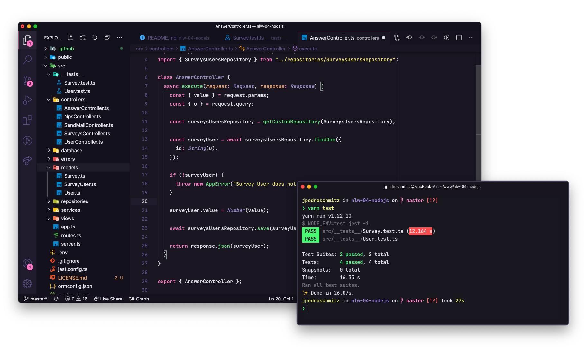
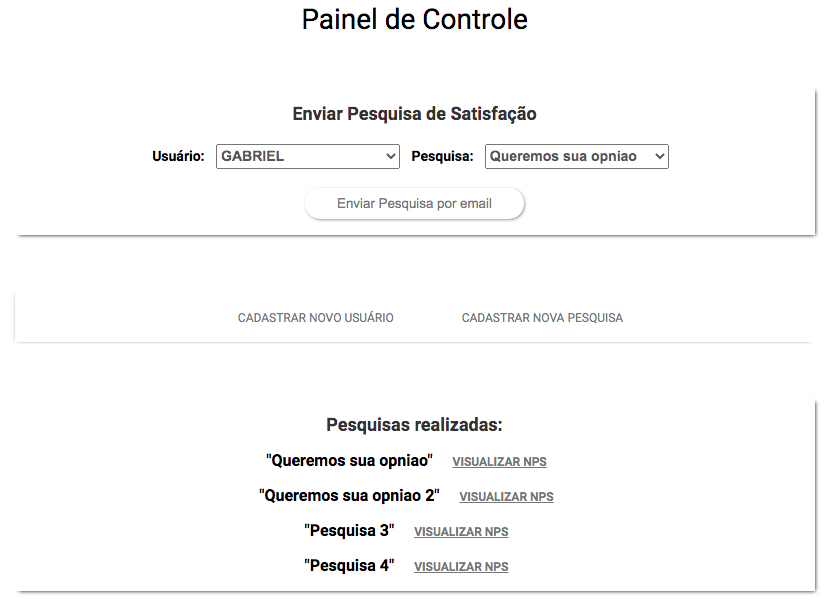

<h1 align="center">NPS-NLW</h1>

<p align="center">
  
</p>

<br />

<p align="center">
  
  
  
  
</p>

<br />

<p align="center">
  <a href="#-sobre-o-projeto">Projeto</a>&nbsp;&nbsp;&nbsp;|&nbsp;&nbsp;&nbsp;
  <a href="#-como-executar-o-projeto">Como executar</a>&nbsp;&nbsp;&nbsp;|&nbsp;&nbsp;&nbsp;
  <a href="#-tecnologias">Tecnologias</a>&nbsp;&nbsp;&nbsp;|&nbsp;&nbsp;&nbsp;
  <a href="#-diagrama-e-painel">Diagrama e Painel</a>&nbsp;&nbsp;&nbsp;|&nbsp;&nbsp;&nbsp;
</p>

<br />

## 💻 Sobre o projeto

O NPS-NLW é uma aplicação que consiste em calcular o NPS da empresa. Nele fazemos o cadastro de usuários, cadastro de pesquisas, envio de e-mail para os usuários responderem as pesquisas de satisfação e com isso podemos realizar o cálculo do NPS.

Esse projeto foi desenvolvido durante a trilha de NodeJS, na quarta edição da NLW, oferecida pela [Rocketseat](https://rocketseat.com.br/). Aprendemos conceitos sobre o que é um API, como iniciar um projeto utilizando Typescript e Express para gerenciamento das rotas, TypeORM para manipulação dos dados, testes automatizados e envio de e-mail. Foi adicionada uma interface de painel de controle para executar os cadastros, envio de email e o cálculo do NPS diretamente pelo browser.

---

## 🚀 Como executar o projeto

```bash

# Clone este repositório

# Instale as dependências com `yarn`

# Inicie o servidor com `yarn dev`

```
**💡 A aplicação pode ser acessada em [`localhost:3333`](http://localhost:3333).**

---

## 🛠 Tecnologias

Esse projeto foi desenvolvido com as seguintes tecnologias:

- [NodeJS](https://nodejs.org/en/)
- [TypeScript](https://www.typescriptlang.org/)
- [Nodemailer](https://nodemailer.com/about/)
- [Ethereal-Email](https://ethereal.email/)
- [Express](https://expressjs.com/)
- [TypeORM](https://typeorm.io/#/)
- [SQLite3](https://www.npmjs.com/package/sqlite3)
- [Jest](https://jestjs.io/)
- [Supertest](https://www.npmjs.com/package/supertest)
- [Express-handlebars](https://www.npmjs.com/package/express-handlebars)
- [YUP](https://github.com/jquense/yup)
- [express-async-errors](https://www.npmjs.com/package/express-async-errors)

> Veja o arquivo  [package.json](https://github.com/marques-gabriel/nps-nlw4/blob/master/package.json)

---

## 🔶 Diagrama e Painel




***

## 💪 Como contribuir para o projeto

1. Faça um **fork** do projeto.
2. Crie uma nova branch com as suas alterações: `git checkout -b my-feature`
3. Salve as alterações e crie uma mensagem de commit contando o que você fez: `git commit -m "feature: My new feature"`
4. Envie as suas alterações: `git push origin my-feature`

---

## 👨🏽‍💻 Autor

<a href="https://github.com/marques-gabriel">
 
 <br />
 <sub><b>Gabriel Marques</b></sub></a> <a href="https://www.linkedin.com/in/marques-gabriel/"">🚀   </a>
 <br />

 [](https://instagram.com/marquesgabriel__) [](https://www.linkedin.com/in/marques-gabriel/) 

---

## 📝 Licença

Este projeto está sob a licença **MIT**.

🖤   Feito por Gabriel Marques  👋🏽   [Entre em contato!](https://www.linkedin.com/in/marques-gabriel/)

---